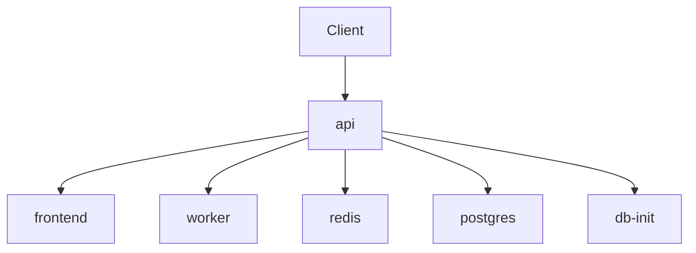

# Deployment Architecture

## Document Control
- Project: AI Recruitment System
- Last updated (UTC): 2026-05-10 18:10:16 UTC

## 1. Runtime Topology
Client -> FastAPI -> Queue -> Worker -> Repository/Result.

## 2. Container And Service Map
- frontend
- api
- worker
- redis
- postgres
- db-init

## 2.1 Service Diagram

## 3. Environment Profile
- Local development: can run eager mode for Celery.
- Docker profile: API + Worker + Redis + Postgres (+ observability services if enabled).

## 4. Service Dependency Matrix
| Service | Depends On | Purpose |
|---|---|---|
| frontend | unknown | service |
| api | redis, postgres | Serve HTTP endpoints |
| worker | redis, postgres | Run async orchestration tasks |
| redis | none | Queue broker/backend |
| postgres | none | Persistent data store |
| db-init | unknown | service |

## 5. Configuration Surface
- REDIS_URL
- DATABASE_URL
- MODEL
- API_BASE
- OPENAI_API_KEY

## 6. Operational Notes
Use Docker Compose for full stack, or local venv with explicit environment variables.

## 7. Observability Checklist
- Verify worker logs include trace_id and status fields.
- Check API health endpoint before running integration tests.
- Ensure queue and database services are reachable before load tests.

## 8. Change Summary
- Last commit: 75d8683 | 2026-05-11 01:01:14 +0700 | nkokkoyit | chore: ignore all test files
- Files changed in last commit:
- .gitignore
