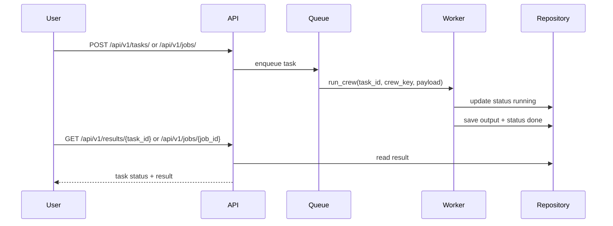

# Sequence Flow

## Document Control
- Project: AI Recruitment System
- Last updated (UTC): 2026-05-10 18:10:16 UTC

## 1. Primary Flow: Analyze Candidate
1. Client submits POST /api/v1/tasks/ or POST /api/v1/jobs/.
2. JobService validates crew metadata, creates job_id, and enqueues worker task.
3. Worker sets status running and executes crew logic for the selected crew.
4. Worker stores output and sets status done.
5. Client polls GET /api/v1/results/{task_id} or GET /api/v1/jobs/{job_id}.

## 1.1 Sequence Diagram

## 1.2 Interaction Table
| Step | Source | Destination | Data |
|---|---|---|---|
| 1 | Client | API | Candidate payload |
| 2 | API | Queue | task_id + payload |
| 3 | Queue | Worker | Async task message |
| 4 | Worker | Repository | status + output |
| 5 | Client | API | Poll by task_id |

## 2. Alternate Flow: Fallback Scoring
1. CrewAI import unavailable.
2. System routes to rule-based scoring service.
3. Result payload returns score/match_level/recommendation.

## 3. Error Flow
1. Worker catches exception.
2. Status updated to failed.
3. Task retries with exponential backoff.

## 4. Traceability Points
- Task ID is used as trace_id in worker logs.
- Status transitions: pending -> running -> done/failed.

## 5. Failure Handling Playbook
- If task creation times out, check queue mode and worker readiness.
- If result polling returns 404 unexpectedly, verify repository lifecycle and task_id propagation.
- If crew path fails, validate fallback behavior and LLM settings.

## 6. Change Summary
- Last commit: 75d8683 | 2026-05-11 01:01:14 +0700 | nkokkoyit | chore: ignore all test files
- Files changed in last commit:
- .gitignore
